# Cozy Fishing Game: Game Design Document

<h2 align = left>
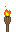
<u><i>1.Introduction</i></u> 

</h2>

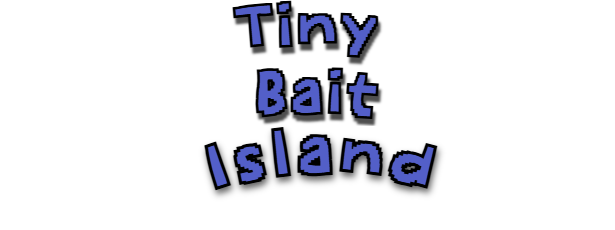
 
<b>Project Title:</b> Tiny Bait
 
 
<b>Type:</b> Video Game
 
<b>Genre:</b> 2D, Casual, Simulation, Life Sim
 
 
<b>Target Audience:</b> 
<ul>
    <li>Players seeking relaxation, stress relief, and a calming experience.</li>
    <li>Players interested in fishing, nature, and cozy aesthetics.</li>
    <li>Casual gamers (13-35 years old).</li>
</ul>
<b>Platform:</b> PC(Steam), Mobile (iOS, Android)

<h2 align = left>

<u><i>2.Executive Summary</i></u> 

</h2>

<b>Logline:</b> A young apprentice eager to learn the ways of a legendary master 
fisherman, embarks on a challenging journey to prove his amazing skills.
 
 
    <b>Gameplay Loop:</b> 
 
<ul>
    <li>Acquire fish and fishing gear.</li>
    <li>Explore an island and vast ocean.</li>
    <li>Fish in a relaxing world.</li>
    <li>Obtain silver from selling fish.</li>
    <li>Spend silver to upgrade fishing rod and other fishing gear.</li>
    <li>Upgrading rods and bobbers can have a better chance at catching better fish.</li>
    <li>Show off your Fish collection to the towns people.</li>
</ul>

<h2 align = left>

<u><i>3.Core Gameplay</i></u>

</h2>

<b>Fishing Mechanics:</b>
<ul>
    <li><i>Variety of Fish:</i> Diverse species of fish (Lake, Ocean, Deep Sea).</li>
    <li><i>Fish quality:</i> Some fish are easier to catch then others depending on its quality.</li>
    <li><i>Day/Night Cycle:</i> Affects fish appearance of the game world.</li>
</ul>
 
<b>Exploration:</b> 
<ul>
    <li><i>Open World:</i> An island surrounded by the ocean waiting to be explored.</li>
    <li><i>Relaxing Ambiance:</i> Peaceful music, calming sound effects (birds, 
    ocean waves, gentle water sounds, rustling trees).</li>
    <li><i>Visual Style:</i> 2D Pixel art with a focus on soft colors, charming characters, and tropical nature.</li>
</ul>
 
<b>Life Simulation Elements:</b>
<ul>
    <li><i>Collect Species:</i> Catch different species of fish and show off your collection to your friends.</li>
    <li><i>Sell Fish:</i> Trade fish you caught for red silver at the fish market and spend your earnings on bobbers and fishing rod upgrades.</li>
    <li><i>Buy Upgrades:</i> The red silver from selling fish can be used to buy bobbers and fishing rods.</li>
</ul>
 
<b>Game Currency:</b> 
 
<i>Red Silver</i>
 

<li>Obtain this game currency by catching fish and selling it to the fish market.</li>
<li>Use this currency to buy fishing rods and bobbers.</li>
 
<b>Character Progression:</b>
<ul>
    <li><i>Level up system:</i> Fishing and catching fish will level up the character and will unlock new fishing rods and fishing bobbers.</li>
    <li><i>Equipment system:</i> The character can equip fishing gear (fishing rods and bobber).
    </li>
    <li><i>Achievement System:</i> Unlockable achievements for completing various challenges and milestones.</li>
</ul>

<h2 align = left>

<u><i>4.Milestone Progression</i></u>

</h2>

<i>February 13:</i> Game Design Document
 
<i>March 13:</i> Project Pitch
 
<i>April 17:</i> Prototype Presentation
 
<i>May 5:</i> Final Game

 

<h2 align = left>

<u><i>5.Characters</i></u>

</h2>

<b>Main Character:</b> <i>Jack the Apprentice</i>
 
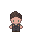
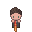
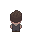
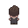
 
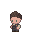
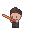
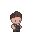
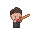

 
<b>Legendary Master Fisherman:</b> <i>Kanto the Legendary Fisherman</i>
 
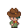
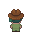
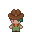
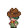
 
 
<b>Player Movement:</b> 
<ul>
    <li>W / Up Arrow</li>
    <li>A / Left Arrow </li>
    <li>S / Down Arrow </li>
    <li>D / Right Arrow </li>
</ul>

<b>Player Interaction:</b> 
<ul>
    <li>Left Mouse Click: World Interaction</li>
    <li>Right Mouse Click: Fishing</li>
</ul>
 

<b>Menu Buttons:</b> 
<ul>
    <li>"Esc" Key: Pause Menu</li>
    <li>"I" Key: Inventory Menu</li>
    <li>"C" Key: Equipment Menu</li>
</ul>
 
<b>Fisherman Ranks:</b>
<ul>
    <li><i>level 1-10:</i> Rookie Fisherman</li>
    <li><i>level 11-25:</i> Apprentice Fisherman</li>
    <li><i>level 25-40:</i> Professional Fisherman</li>
    <li><i>level 41-55:</i> Master Fisherman</li>
    <li><i>level 56-80:</i> Legendary Fisherman</li>
 

<h2 align = left>

<u><i>6.Game Level & Maps</i></u>

</h2>

<i>Building Locations:</i>
 
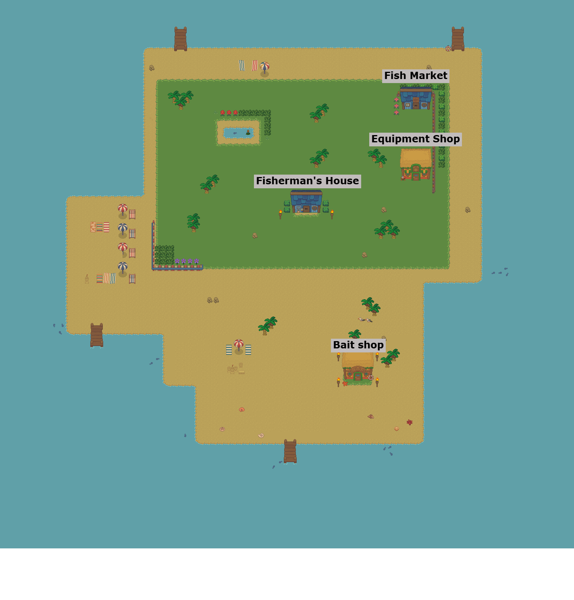
 

<h2 align = left>

<u><i>7.User Interface Designs</i></u>

</h2>

Main Menu:
 
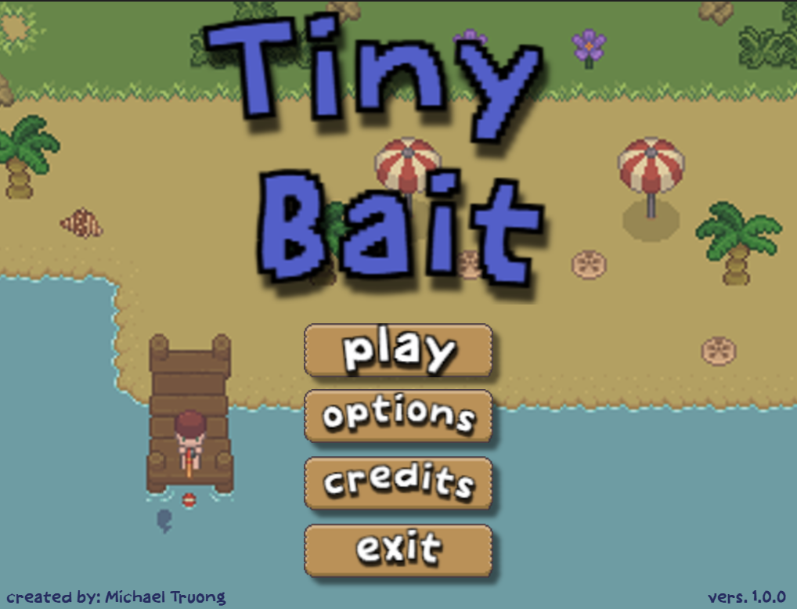
 
HUD:
 
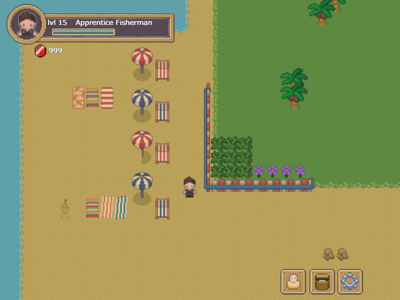
 
Pause Menu:
 
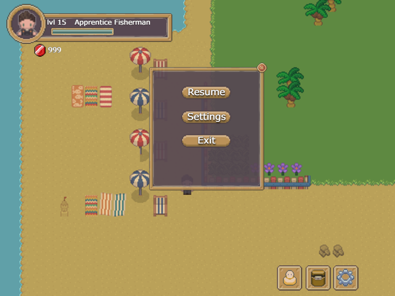
 
Inventory & Equipment Menu:
 
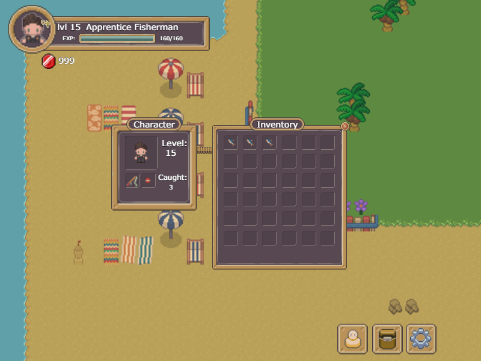

<h2 align = left>

<u><i>8.Fish Species</i></u>

</h2>

<h4><i>25 different species of fish</i></h4>

<table>
<tr>
<th>$${\color{Gray}Common}$$</th>
<th>$${\color{Green}Rare}$$</th>
<th>$${\color{Blue}Unique}$$</th>
<th>$${\color{Purple}Elite}$$</th>
<th>$${\color{Orange}Mythic}$$</th>
</tr>
<tr>
    <td>Mackerel 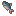</td>
    <td>Tuna 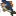</td>
    <td>Cow Fish </td>
    <td>Clown Fish 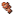</td>
    <td>Axolotl 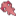</td>
</tr>
<tr>
    <td>Shrimp </td>
    <td>Atlantic Bass 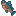</td>
    <td>Lion Fish 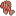</td>
    <td>Angel Fish 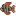</td>
    <td>Angler Fish 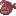</td>
</tr>
<tr>
    <td>Tilapia 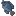</td>
    <td>Butterfly Fish 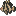</td>
    <td>Parrot Fish 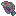</td>
    <td>King Salmon 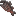</td>
    <td>Black Goldfish 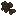</td>

</tr>
<tr>
<td>Crab 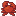</td>
<td>Salmon 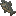</td>
<td>Koi 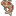</td>
<td>Piranha 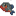</td>
<td>Gray Shark 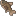
</tr>
<tr>
<td>Black Bass 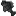</td>
<td>Pufferfish 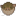</td>
<td>Octopus </td>
<td>Eel 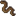</td>
<td>Blue Lobster 

</table>

<h2 align = left>

<u><i>9.Fishing Equipment</i></u>

</h2>

<i>Fishing Rods:</i>
 
(The better the qaulity of the Rod, the higher quality fish you can catch.)
 
Wooden Fishing Rod
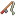 (+0% catch rate)
 
Iron Fishing Rod
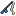 (+5% catch rate)
 
Gold Fishing Rod
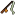 (+15% catch rate)
 
Diamond Fishing Rod
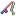 (+20% catch rate)
 
 
<i>Bobbers:</i>
 
(Bobbers help with catching higher quality fish if you can't afford a higher quality fishing Rod.)
 
Stock Bobber  (+3% catch rate)
 
Pro Bobber 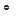 (+5% catch rate)
 
Super Bobber  (+10% catch rate)
 
Expert Bobber  (+15% catch rate)
 
Ultimate Bobber  (+20% catch rate)
 
Insanity Bobber  (+25% catch rate)
 
Atomic Bobber  (+30% catch rate)
 
Cosmic Bobber  (+35% catch rate)
 
 
<i>Upgraded Fishing Rods:</i>
 
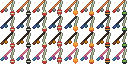

<h2 align = left>

<u><i>10.Game Music & Sound FX</i></u>

</h2>

Ambient Music:
 
<i>Droplets of dew</i> (From Zapsplat.com)
 
<i>Shanty Town</i> (By FoolBoyMedia)
 
 
<b>Sound Effects:</b>
 
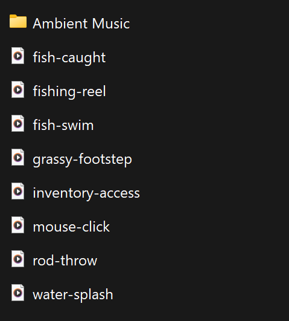
 

<h2 align = left>

<u><i>11.Enhanced Features</i></u>

</h2>

<i>Dialogoue:</i> Custom dialogue between the characters to introduce origin stories.
 
 
<i>Operable Vehicle:</i>  A vehicle that can be used to traverse the ocean.
 
 
<i>Character Customization:</i> Customize your character with different wardrobes and accessories.

<h2 align = left>

<u><i>12.Credits</i></u>

</h2>

Created by Michael Truong

